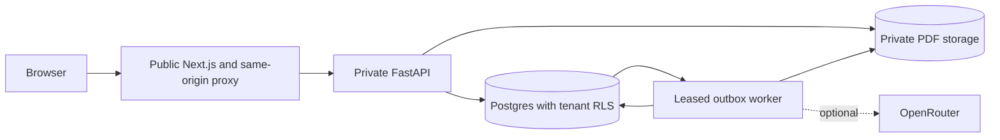

# OpsPilot

[](https://github.com/Abhinavsuri90/opspilot/actions/workflows/ci.yml)

**An invoice workspace for organizations and their reviewers.** Create a company workspace, approve joining teammates, upload PDFs, inspect original documents, discuss discrepancies and track verified invoice decisions.

Built with Next.js, React, TanStack Query, FastAPI, Postgres row-level security and S3-compatible storage. Extraction, validation and governed actions run asynchronously through a durable Postgres outbox. Optional OpenRouter extraction accepts a configurable model; human review, totals and governance operate independently of model access.


## What works

- Public product homepage with workflow explanations and separate entry points for organization owners, members and reviewers.
- Organization registration and company selection at login/join; admin approval for joining members/reviewers.
- Admin-managed invoice categories and membership approval, role selection, rejection and suspension.
- PDF upload, tenant-specific deduplication, background extraction, source evidence and retry.
- Per-field confidence from six signals (grounding, format, cross-field rules, optional model agreement, optional vendor memory prior and self-report), configurable thresholds, and plain-language reasons for every flagged field.
- Versioned per-organization workflow configuration: document types, typed fields and cross-field rules in a safe rule grammar; new organizations default to reviewing every document.
- Field-level accept and edit as append-only corrections, review tasks with an SLA, a filterable review queue and a per-document timeline.
- Governed actions after approval: one proposal per configured destination with a preview of exactly what will be sent, a per-type policy (auto, needs approval, forbidden), an organization kill switch and shadow mode re-checked immediately before every external call, idempotency keys, retries with backoff and a dead-letter queue with manual retry.
- Connectors with encrypted credentials and connection tests: HMAC-signed webhook, CSV export, Postgres table and Google Sheets.
- Workflow configuration API with YAML import and export, append-only versions and inline validation errors.
- Multi-customer templates: invoices, or logistics with purchase orders and delivery notes, detected from configured keywords with their own fields and rules.
- Three intake channels with identical deduplication and audit: browser upload, an organization API key for programmatic submission, and a polled mailbox (IMAP, or Mailpit locally) that keeps the email body as context.
- Near-duplicate detection on party, identifier and total that links both documents and forces review.
- Optional two-tier model extraction: route only uncertain fields to a second configured model; keep the first result available for review if escalation fails.
- Tenant-scoped vendor profiles and correction examples, retrieved with a local embedding and pgvector; reviewed examples can enter a versioned model prompt.
- A model-call ledger with estimated cost, token and latency accounting; admin-set daily spend guardrail; weekly field-accuracy chart and an admin synthetic-evaluation page.
- KPIs: documents processed, auto-approve rate, field accuracy, model escalation, estimated cost per document, median time to complete, queue depth and hours saved against a configurable baseline.
- Full PDF viewing with page navigation, zoom, selectable page text and download; reviewer assignment, verified amount/currency and approve/reject/reopen.
- Invoice comments, decision history and authenticated sharing with restricted visibility.
- Dashboard, review queue, category filters, paginated inbox, Insights and a role-aware in-app Guide.
- SQL-backed questions about counts, totals, categories and extracted invoice fields with citations.
- Restricted runtime database role, tenant RLS, optimistic versions and append-only history.

Public deployment is not yet verified. [Oracle Free Tier setup and the paid Render alternative](docs/deployment.md) and [the system design](SYSTEM_DESIGN.md) explain the deployment paths, operational limits and scaling choices.

## Start locally with your own organization

Start Docker Desktop, then run from this directory:

```sh
LLM_PROVIDER=rules OPENROUTER_API_KEY= make up
```

This builds the services, starts Postgres/storage, applies migrations and waits for the application. It creates `.env` from `.env.example` only when missing. It preserves existing data and does **not** create demo accounts.

1. Open [localhost:3300](http://localhost:3300) for the product homepage and choose the organization-owner entry point.
2. Create your organization with a name, unique slug, your email and a password of at least 12 characters. You become the organization admin.
3. In **Admin**, create categories such as Travel, Software or Office supplies.
4. In a separate browser profile/private window, open the homepage and choose the member or reviewer entry point. Select your organization and submit a join request.
5. As admin, approve the request in Admin. The teammate can then sign in using that organization, email and password.
6. In **Inbox**, upload a supported PDF. Fictional [single-page](examples/northwind-invoice.pdf) and [two-page](examples/multipage-invoice.pdf) invoices are available for testing.
7. After extraction, select **Full document** to inspect every PDF page. Save the category, reviewer, verified amount and currency. Add a comment and approve or reject.
8. Open **Insights** for totals and questions such as “How many invoices need review?” or “What is the total amount pending review?”

Local web: `http://localhost:3300`. API/OpenAPI: `http://localhost:8000/docs`.

### A populated local example

To explore the whole flow with fictional companies and existing decisions, run this from the project directory after Docker Desktop is running:

```sh
make demo
```

`make demo` starts the stack with the **rules parser** (no model API key), creates Northwind Traders and Contoso Logistics, then uses the actual HTTP API to upload four fictional PDFs. Each organization gets an admin, reviewer and member, two categories, one approved invoice and one awaiting review with a team comment. Repeating the command preserves existing records and manual edits. `make up` remains the path for creating your own organization without sample accounts.

| Organization at sign-in | Role | Email |
| --- | --- | --- |
| `northwind` | Admin | `northwind@example.com` |
| `northwind` | Reviewer | `northwind.reviewer@example.com` |
| `northwind` | Member | `northwind.member@example.com` |
| `contoso` | Admin | `contoso.admin@example.com` |
| `contoso` | Reviewer | `contoso@example.com` |
| `contoso` | Member | `contoso.member@example.com` |

All six fictional accounts use `DEMO_PASSWORD` from your ignored `.env`. Set your own value there before running the seed. Existing demo account passwords are intentionally preserved; if you changed the value, run `RESET_DEMO_CREDENTIALS=1 make demo` to reset only those fictional accounts. On sign-in, enter the organization slug, email and that password. Open **Guide** for a role-specific tour, **Inbox** for the source documents and team comments, **Review** for the pending decision, and **Insights** for approved and pending totals. These accounts are local examples; public signup is the real organization flow.

```sh
make logs   # follow service logs; Ctrl-C stops following
make down   # stop services; retain database and original PDFs
```

## Pages

There are **seventeen screen routes**: three public entry pages, seven shared workspace routes and seven admin routes. They ship together in one web application.

| Route | Access | Purpose |
| --- | --- | --- |
| `/` | Public | Product overview, workflow, features, role choices and frequently asked questions |
| `/register` | Public | Create an organization or request to join one |
| `/login` | Public | Select organization and sign in; pending accounts get an explanation |
| `/dashboard` | Approved account | KPIs, estimated model usage, daily activity and weekly reviewer-correction chart, approvals and dead letters, recent documents |
| `/inbox` | Approved account | Upload several PDFs at once, filter by status, category, type and source, inspect PDF and evidence, see email context and near-duplicate warnings, review, comment and manage access |
| `/review` | Approved account | Filterable queue of invoices awaiting a decision with SLA and flagged-field counts; `/review/[id]` is the keyboard-first split view for corrections and decisions |
| `/guide` | Approved account | Role-aware introduction, invoice lifecycle, page map and plain-language terms |
| `/insights` | Approved account | Verified currency totals, category distribution and bounded invoice questions |
| `/actions` | Approved account | Pending approvals with a preview of exactly what will be sent, execution history and the dead-letter queue |
| `/settings/policies` | Organization admin | Kill switch, shadow mode, daily model spend guardrail and per-action-type policy |
| `/settings/connectors` | Organization admin | Webhook, CSV export, Postgres table and Google Sheets connectors with connection tests and export downloads |
| `/settings/workflow` | Organization admin | YAML workflow configuration: document types, fields, thresholds, rules and destinations |
| `/settings/api-keys` | Organization admin | Keys for programmatic document submission, shown once and revocable |
| `/settings/email-inbox` | Organization admin | Polled mailbox setup, connection test and polling status |
| `/admin` | Organization admin | Membership and category management |
| `/evals` | Organization admin | Latest synthetic extraction evaluation, learning comparison and limitations |

The homepage links to `/register?mode=create`, `/register?mode=join&role=member` and `/register?mode=join&role=reviewer`. These preselect the form; they do not grant permissions. Joining users remain pending until an admin approves their membership and role. Everyone uses the same `/login` page with their organization, email and password; the API checks their current membership and permissions.

Admins can manage the organization. Reviewers can verify and decide eligible invoices. Members can upload and discuss accessible invoices. Viewers have read-only access. A restricted invoice remains visible to its uploader, assigned reviewer, admins and selected teammates. A shared link always requires an approved account with access.

## Extraction providers

`rules` is the default offline provider. It reads explicitly labeled lines for every field configured for the document type (for the default invoice: `Vendor:`, `Invoice Number:`, `Invoice Date:`, `Due Date:`, `Subtotal:`, `Tax:`, `Total:`, `Currency:`, `PO Number:`). It is a limited parser, not general AI or OCR. No API key is required to use the complete review workflow locally.

For varied text invoices, configure OpenRouter in your ignored `.env` or Render secrets:

```dotenv
LLM_PROVIDER=openrouter
OPENROUTER_API_KEY=your_new_private_key
OPENROUTER_MODEL=your_chosen_model_id
```

Select a currently available model that supports strict structured output, then restart the worker:

```sh
docker compose up -d --force-recreate worker
```

Only the worker receives the model key. PDF text is sent to the configured provider. The application validates exact source evidence before accepting extracted fields. Live accuracy, cost and latency depend on the selected model and require testing. Rotate any key previously disclosed in chat; keep keys out of commits and screenshots.

Supported uploads: unencrypted text-layer PDF, up to 10 MB, 10 pages and 50,000 text characters. Scanned invoices require OCR, which is not implemented. New organizations require human review by default; an admin can opt into threshold-based automatic approval. Verified totals use exact decimals and separate currencies; they do not represent payments or accounting balances.

The spend cap is a **soft estimate**: it checks recorded model-call cost before another call, and concurrent calls can pass together. The local price table may differ from a provider bill. The 150-document synthetic evaluation is available with `make eval`; the deterministic mock presently shows no exact-match gain after memory examples are loaded. Neither its scores nor reviewer-correction percentages establish real customer-document accuracy.

## Verification

With Docker running and Node.js 22.13 or newer installed:

```sh
make seed                 # optional fictional accounts for the legacy smoke suites
make lint typecheck test
make smoke
make smoke-ui
make smoke-tenants
make smoke-workspace      # fresh organization -> membership -> category -> invoice decision
(cd apps/web && npm run test:e2e:errors)
(cd apps/web && npm run test:e2e:public) # homepage, role entry links, auth navigation and mobile layout
make eval                  # produces the report shown in admin Quality lab
(cd apps/web && node --env-file=../../.env scripts/e2e-learning.mjs) # dashboard, guide, cap and report
```

`make demo` explicitly starts the stack and populates optional Northwind/Contoso examples. Normal `make up` does not seed them. Database integration and browser suites require Docker; local unit tests alone do not establish the whole stack is working.

```sh
LLM_PROVIDER=mock OPENROUTER_API_KEY= make eval
```

Evaluation reports are ignored by Git. Browser tests use installed Chrome; set `PLAYWRIGHT_CHROME_PATH` if needed. The workspace smoke reports small local sequential latency samples, not a load-test capacity claim.

## Architecture and deployment



- [System design](SYSTEM_DESIGN.md): implemented architecture, data model, permissions, concurrency, recovery, latency targets and capacity calculations.
- [Deployment](docs/deployment.md): Oracle VM with private API/worker/Postgres and OCI PDF storage; paid Render alternative.
- [Architecture decisions](docs/adr/): tenant isolation, local storage, outbox, shared throttling, free-VM deployment, confidence scoring and governed actions.
- [Product roadmap](SPEC.md): original broader vision; not a claim that all roadmap features exist.

All seventeen screen routes run in one Next.js service. On Oracle, `infra/oracle/compose.yaml` adds Caddy HTTPS, separate private API/worker containers and persistent PostgreSQL. The browser uses the web service's same-origin API proxy; the API has no public port. The [deployment guide](docs/deployment.md) covers signup, free resource limits, private storage, migrations, backups and hosted checks. Oracle availability and hosted behavior remain to be verified. The existing Render Blueprint uses paid plans.

Remaining work before an unrestricted public service includes account email verification/recovery, stronger public signup abuse controls, isolated hostile-PDF parsing, operational alerts, backup restore validation and a real deployed acceptance test. There is no SSO, payment execution, ERP connector or arbitrary conversational assistant in the current application.
