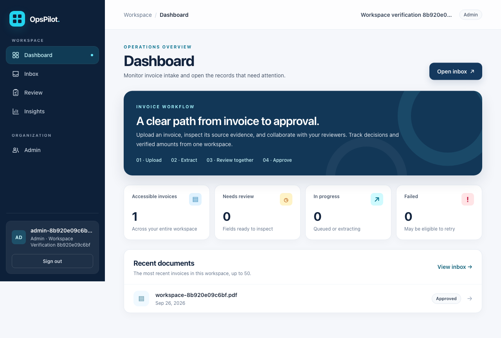
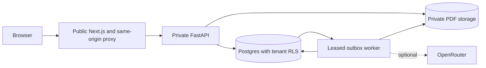

# OpsPilot

[](https://github.com/Abhinavsuri90/opspilot/actions/workflows/ci.yml)

**An invoice workspace for organizations and their reviewers.** Create a company workspace, approve joining teammates, upload PDFs, inspect original documents, discuss discrepancies and track verified invoice decisions.

Built with Next.js, React, TanStack Query, FastAPI, Postgres row-level security and S3-compatible storage. Extraction runs asynchronously through a durable Postgres outbox. Optional OpenRouter extraction accepts a configurable model; human review and totals operate independently of model access.



## What works

- Organization registration and company selection at login/join; admin approval for joining members/reviewers.
- Admin-managed invoice categories and membership approval, role selection, rejection and suspension.
- PDF upload, tenant-specific deduplication, background extraction, source evidence and retry.
- Full PDF viewing with page navigation, zoom, selectable page text and download; reviewer assignment, verified amount/currency and approve/reject/reopen.
- Invoice comments, decision history and authenticated sharing with restricted visibility.
- Dashboard, review queue, category filters, paginated inbox and Insights.
- SQL-backed questions about counts, totals, categories and extracted invoice fields with citations.
- Restricted runtime database role, tenant RLS, optimistic versions and append-only history.

Public deployment is not yet verified. [Render setup](docs/deployment.md) and [the system design](SYSTEM_DESIGN.md) explain the deployment path, operational limits and scaling choices.

## Start locally with your own organization

Start Docker Desktop, then run from this directory:

```sh
LLM_PROVIDER=rules OPENROUTER_API_KEY= make up
```

This builds the services, starts Postgres/storage, applies migrations and waits for the application. It creates `.env` from `.env.example` only when missing. It preserves existing data and does **not** create demo accounts.

1. Open [localhost:3300/register](http://localhost:3300/register).
2. Choose **Create organization**, enter a name, unique slug, your email and a password of at least 12 characters. You become the organization admin.
3. In **Admin**, create categories such as Travel, Software or Office supplies.
4. In a separate browser profile/private window, open Register and request to join that organization as a reviewer or member.
5. As admin, approve the request in Admin. The teammate can then sign in using that organization, email and password.
6. In **Inbox**, upload a supported PDF. Fictional [single-page](examples/northwind-invoice.pdf) and [two-page](examples/multipage-invoice.pdf) invoices are available for testing.
7. After extraction, select **Full document** to inspect every PDF page. Save the category, reviewer, verified amount and currency. Add a comment and approve or reject.
8. Open **Insights** for totals and questions such as “How many invoices need review?” or “What is the total amount pending review?”

Local web: `http://localhost:3300`. API/OpenAPI: `http://localhost:8000/docs`.

```sh
make logs   # follow service logs; Ctrl-C stops following
make down   # stop services; retain database and original PDFs
```

## Pages

| Route | Purpose |
| --- | --- |
| `/register` | Create an organization or request to join one |
| `/login` | Select organization and sign in; pending accounts get an explanation |
| `/dashboard` | Counts across all accessible invoices and recent activity |
| `/inbox` | Upload, search, filter categories/status, paginate, inspect PDF/evidence, review, comment and manage access |
| `/review` | Paginated queue of invoices awaiting a decision |
| `/insights` | Verified currency totals, category distribution and bounded invoice questions |
| `/admin` | Admin-only membership and category management |

Admins can manage the organization. Reviewers can verify and decide eligible invoices. Members can upload and discuss accessible invoices. Viewers have read-only access. A restricted invoice remains visible to its uploader, assigned reviewer, admins and selected teammates. A shared link always requires an approved account with access.

## Extraction providers

`rules` is the default offline provider. It reads explicitly labeled `Vendor:`, `Invoice Number:`, `Invoice Date:` and `Total:` text. It is a limited parser, not general AI or OCR.

For varied text invoices, configure OpenRouter in your ignored `.env` or Render secrets:

```dotenv
LLM_PROVIDER=openrouter
OPENROUTER_API_KEY=your_new_private_key
OPENROUTER_MODEL=your_chosen_model_id
```

Select a currently available model that supports strict structured output, then restart the worker:

```sh
docker compose up -d --force-recreate worker
```

Only the worker receives the model key. PDF text is sent to the configured provider. The application validates exact source evidence before accepting extracted fields. Live accuracy, cost and latency depend on the selected model and require testing. Rotate any key previously disclosed in chat; keep keys out of commits and screenshots.

Supported uploads: unencrypted text-layer PDF, up to 10 MB, 10 pages and 50,000 text characters. Scanned invoices require OCR, which is not implemented. Every extracted invoice requires human review. Verified totals use exact decimals and separate currencies; they do not represent payments or accounting balances.

## Verification

With Docker running and Node.js 22.13 or newer installed:

```sh
make seed                 # optional fictional accounts for the legacy smoke suites
make lint typecheck test
make smoke
make smoke-ui
make smoke-tenants
make smoke-workspace      # fresh organization -> membership -> category -> invoice decision
cd apps/web && npm run test:e2e:errors
```

`make demo` explicitly starts the stack and creates optional Northwind/Contoso sample accounts. Normal `make up` does not seed them. Existing seed passwords are preserved. Tests and sample PDFs are synthetic; automated success is not a measurement of extraction accuracy on customer invoices.

```sh
LLM_PROVIDER=mock OPENROUTER_API_KEY= make eval
```

Evaluation reports are ignored by Git. Browser tests use installed Chrome; set `PLAYWRIGHT_CHROME_PATH` if needed. The workspace smoke reports small local sequential latency samples, not a load-test capacity claim.

## Architecture and deployment



- [System design](SYSTEM_DESIGN.md): implemented architecture, data model, permissions, concurrency, recovery, latency targets and capacity calculations.
- [Render deployment](docs/deployment.md): private API, public web, worker, managed Postgres and external S3/R2.
- [Architecture decisions](docs/adr/): tenant isolation, local storage, outbox and shared throttling.
- [Product roadmap](SPEC.md): original broader vision; not a claim that all roadmap features exist.

Remaining work before an unrestricted public service includes account email verification/recovery, stronger public signup abuse controls, isolated hostile-PDF parsing, operational alerts, backup restore validation and a real deployed acceptance test. There is no SSO, payment execution, ERP connector or arbitrary conversational assistant in the current application.
