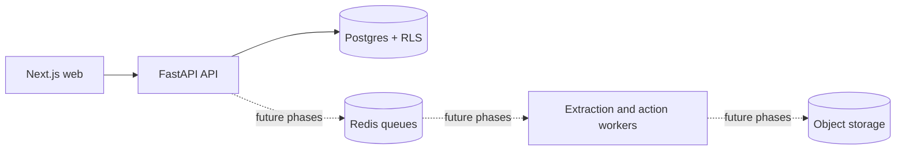

# OpsPilot

**Governed document operations:** turn messy business documents into reviewed data and policy-controlled actions.

_[Demo GIF placeholder — record after the end-to-end workflow exists.]_

Small teams spend time retyping invoices, purchase orders, and delivery notes into spreadsheets and older systems. OpsPilot is being built to extract the data, flag uncertainty for a reviewer, and execute approved actions with an audit trail. The repository currently contains **Phase 0 only**: an authenticated, tenant-isolated foundation and an empty dashboard.



## What works now

- Login and logout with Argon2 password hashes and an HTTP-only JWT cookie.
- Two fictional seeded organizations and role-bearing memberships.
- Application-scoped membership queries plus Postgres row-level security.
- Append-only application grants on audit events.
- Health and readiness endpoints, OpenAPI docs at `/docs`, request IDs, and a typed frontend API client.

## Measured metrics

| Metric | Result |
|---|---|
| Extraction accuracy | [TODO: real eval result] |
| Review recall | [TODO: real eval result] |
| Document throughput | [TODO: measured benchmark] |
| Time saved | [TODO: real deployment measurement] |

## Quickstart

Starting the app requires Docker Desktop and Docker Compose. The check and browser-smoke targets also require Node.js 22 and npm. From this directory:

```sh
make up
```

Open `http://localhost:3300`, then sign in to `northwind` with `northwind@example.com` and the `DEMO_PASSWORD` from `.env`. `make up` copies `.env.example` to `.env` when needed, builds services, migrates the database, and seeds fictional data. The API is at `http://localhost:8000`; OpenAPI docs are at `/docs`.

```sh
make lint typecheck test
make smoke
make smoke-ui
make down
```

`.env.example` contains local-only credentials. Change every secret for deployment. The API must use `DATABASE_URL` (the restricted app role); migration and seeding use `DATABASE_OWNER_URL`.

`make smoke-ui` uses an installed Chrome at `/Applications/Google Chrome.app` by default. Set `PLAYWRIGHT_CHROME_PATH` to another Chromium executable when needed.

## Tradeoffs and roadmap

The foundation uses a shared Postgres schema with RLS and a dedicated application role. This gives two isolation layers without separate databases for each organization. It does require Postgres integration tests and careful migrations. Redis, Adobe S3Mock and Mailpit are included in local Compose for future phases; extraction workers and the legacy portal have not been built yet. S3Mock replaces the original local MinIO plan because the planned images could not be pulled during setup; see [ADR 002](docs/adr/002-local-s3-emulator.md).

The next phase adds upload, durable storage, the transactional outbox, extraction, and the first eval. Later phases add review, policies and connectors, config-driven onboarding, learning, a browser connector, hardening, and production deployment. The full scope is in [SPEC.md](SPEC.md), and architectural decisions are in [SYSTEM_DESIGN.md](SYSTEM_DESIGN.md) and `docs/adr/`.
