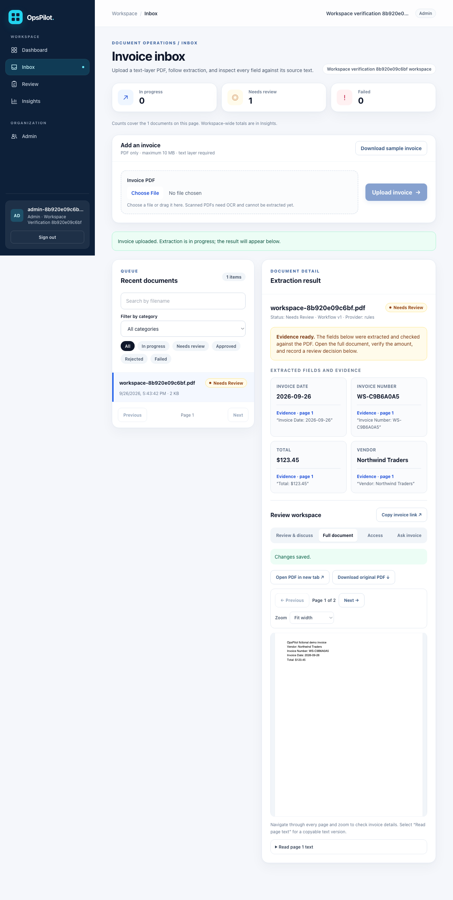
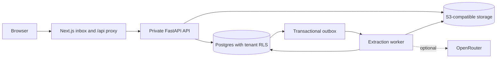

# OpsPilot

[](https://github.com/Abhinavsuri90/opspilot/actions/workflows/ci.yml)

**A tenant-isolated invoice intake and extraction prototype.** OpsPilot accepts PDF invoices, stores them in S3-compatible storage, extracts four fields with page-level evidence, and places the result in an inbox for human review. The broader product vision includes approval, policy-controlled actions, and legacy-system connectors; those workflows are still planned.



| Area | Current status |
| --- | --- |
| Auth, memberships, tenant isolation, audit | Working locally; Postgres integration tests |
| PDF upload, object storage, durable outbox, worker, failed-job retry | Working locally; browser smoke test |
| Extraction provider | Deterministic local mock by default; optional OpenRouter adapter tested with a fake HTTP response |
| Evaluation | 20 generated text-layer invoices; mock baseline in CI; live model run available locally |
| Human review, approval, actions, scanned PDFs | Planned |
| Public staging deployment | Pending |



## Run locally

Docker Desktop and Docker Compose are required. Node.js 22 and npm are required for frontend checks and the browser smoke test.

```sh
make up
```

Open `http://localhost:3300`. Sign in to organization `northwind` as `northwind@example.com` with `DEMO_PASSWORD` from your local `.env`. Open **Inbox**, download the fictional sample invoice from the page, and upload it. The browser uses the web service's same-origin `/api` proxy; the local API is also available at `http://localhost:8000`, with OpenAPI docs at `/docs`.

```sh
make lint typecheck test
make smoke
make smoke-ui
make eval
make down
```

`make up` creates `.env` from `.env.example` when needed, builds the services, starts local infrastructure, migrates the database, seeds fictional accounts, and waits for the web and API health checks. `make eval` writes a timestamped JSON and Markdown report to `evals/reports/` (ignored by Git). The CI mock baseline exercises the generated invoices and parser. It is **not** a measurement of AI accuracy on real invoices. `make smoke-ui` uses an installed Chrome by default; set `PLAYWRIGHT_CHROME_PATH` to another Chromium executable if needed.

## Optional OpenRouter extraction

The local mock works without an API key. To use a live model, create a **new** OpenRouter key and edit only your ignored `.env`:

```dotenv
LLM_PROVIDER=openrouter
OPENROUTER_API_KEY=your_new_key_here
OPENROUTER_MODEL=google/gemini-3.8-flash
```

Restart the worker with `docker compose up -d --force-recreate worker` and generate a fresh fictional invoice before uploading it. Existing uploads are deduplicated by content hash.

```sh
python3 scripts/generate_demo_invoice.py /tmp/opspilot-live-test.pdf --invoice-number NW-2026-002
```

To run the same 20-invoice suite against OpenRouter, use:

```sh
docker compose run --rm -v "$PWD/evals/reports:/workspace/evals/reports" worker python -m evals.run --provider openrouter
```

The model ID is a starting choice because OpenRouter [lists it with structured JSON support](https://openrouter.ai/google/gemini-3.8-flash); the project has not benchmarked it against alternatives. The worker sends extracted PDF text to OpenRouter, so only send data you are authorized to share. Do not commit `.env` or paste keys into issues, commits, or chats.

## Current limits and design

- Uploads accept PDFs up to 10 MB. Extraction currently accepts unencrypted PDFs with a text layer, up to 10 pages and 50,000 extracted characters. Scanned PDFs need OCR or a vision path. Failed documents can be retried from the Inbox. A per-organization document cap limits demo storage growth (`MAX_DOCUMENTS_PER_ORG`, default 100).
- The worker polls the Postgres outbox directly. This provides a durable first slice; Redis queue dispatch, richer state transitions, provider routing, confidence scoring, review edits, and actions remain to be built. See [ADR 003](docs/adr/003-direct-outbox-polling.md).
- Application database access uses a restricted role plus Postgres row-level security. Migrations and seeding use a separate owner connection. Local storage is Adobe S3Mock; deployments should use S3 or R2.
- Staging and production are not deployed or verified. The [deployment runbook](docs/deployment.md) recommends Railway for the first private demo and lists the exact service, secret, bucket, and smoke-test setup. The [readiness review](docs/deployment-readiness-review.md) records the problems fixed and the remaining gates. The target architecture is in [SYSTEM_DESIGN.md](SYSTEM_DESIGN.md), and the full roadmap is in [SPEC.md](SPEC.md).
