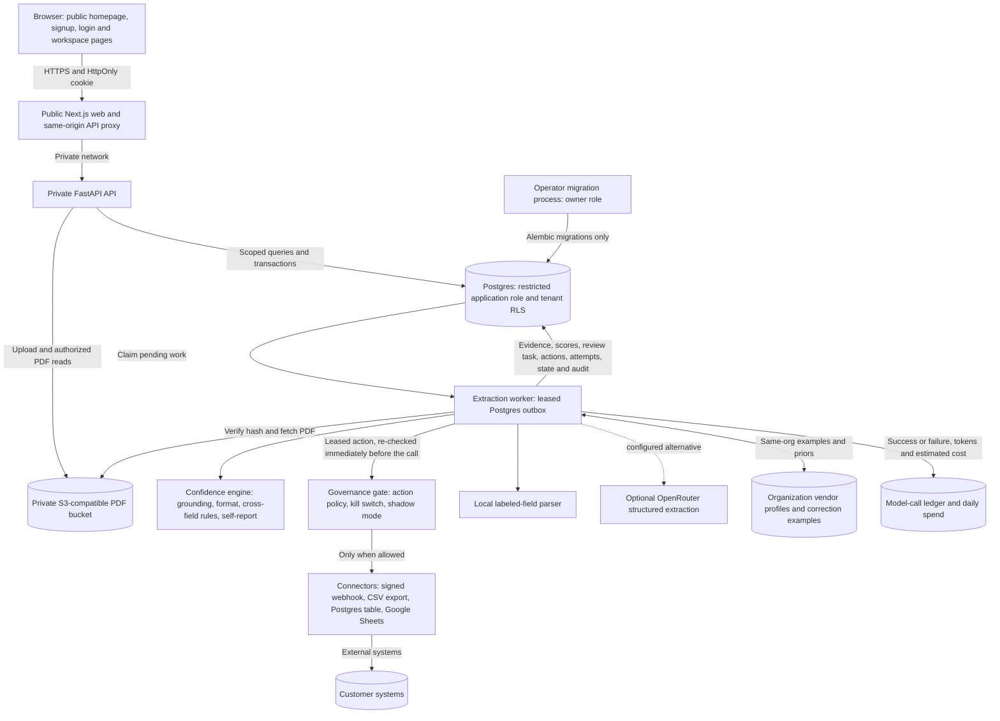
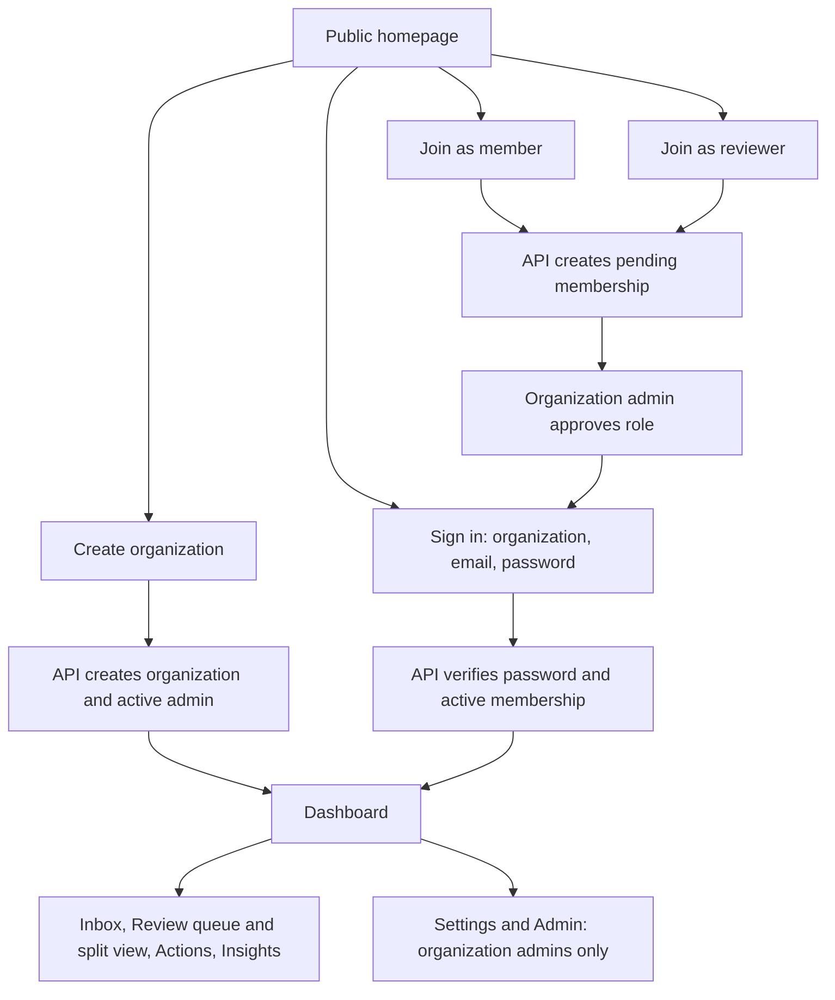
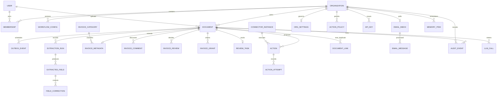
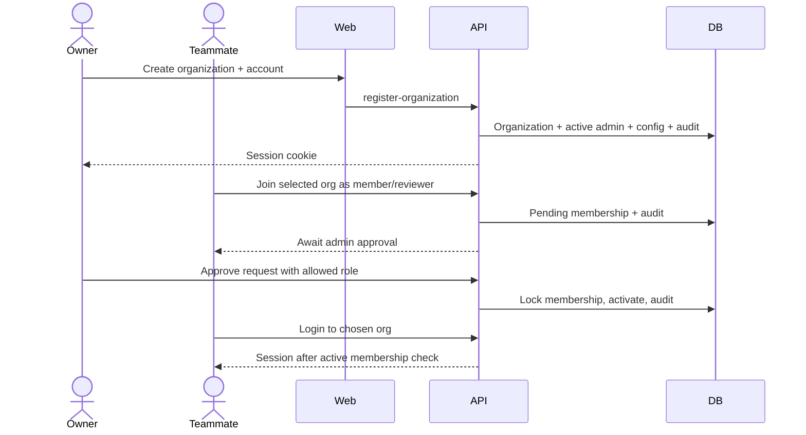
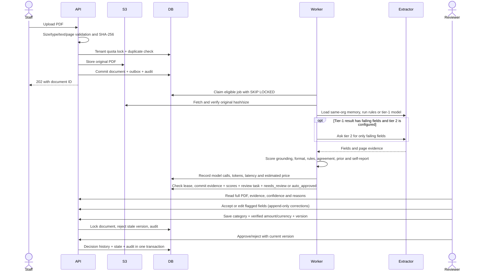
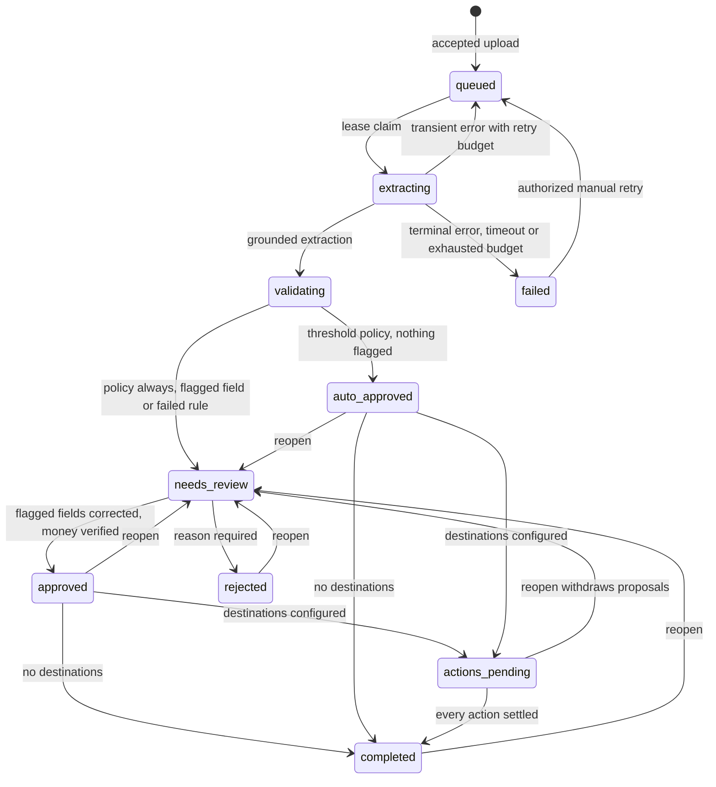

# OpsPilot system design

A multi-organization invoice review application. This document describes the implemented architecture and identifies proposed changes explicitly. Deployment instructions are in [the hosting runbook](docs/deployment.md). Product scope and page walkthroughs are in [README.md](README.md).

## 1. Problem and scope

A company receives PDF invoices. Staff need to extract information, route documents to reviewers, discuss discrepancies, organize invoices by category, and track amounts awaiting approval. People must only access the companies and documents they are permitted to see.

The product supports:

- Self-service organization creation with an initial admin.
- Requests to join an organization as a member or reviewer, followed by admin approval.
- PDF intake, content deduplication, asynchronous extraction and evidence inspection.
- Original PDF viewing with page navigation, zoom and copyable text, plus download under the same authorization as invoice metadata.
- Admin-managed categories, reviewer assignment, verified money, comments and decisions.
- Workspace or restricted document visibility, with authenticated sharing links.
- Counts and currency-separated totals across all accessible invoices.
- Bounded questions answered from current database records and extracted evidence.

Approval records a workflow decision. It does not pay an invoice, establish accounting accuracy, or send anything to an external accounting system. OCR, arbitrary conversational reasoning, SSO, email verification, password recovery, payment execution and ERP connectors are not implemented.

## 2. Architecture



### Component responsibilities

| Component | Owns | Scaling boundary |
| --- | --- | --- |
| Next.js | Pages, typed API client, TanStack Query cache, same-origin proxy | Stateless web replicas |
| FastAPI | Authentication, permissions, validation, invoice workflow, field corrections, review queue, timeline, PDF delivery | Stateless API replicas; Postgres connection budget applies |
| Postgres | Accounts, tenancy, workflow state, durable jobs, immutable evidence, audit | Vertical scaling first; inspect actual query plans before adding replicas |
| Worker | PDF text parsing, optional two-tier model routing, same-org memory retrieval, evidence validation, confidence scoring, rule evaluation, review-task creation, action proposal and execution behind the governance gate, durable completion | One job at a time per process under hard timeouts; add workers within provider, connector and DB limits |
| Connectors | Typed configuration, encrypted credentials, connection tests, preview diffs, idempotent execution against customer systems | Each call bounded by a timeout; retries with backoff; dead-letter queue after five attempts |
| Object store | Original PDF bytes | Managed private bucket; backup/versioning configured by operator |
| Migration process | Schema and restricted-role grants | One serialized release step; owner credentials excluded from serving processes |

There is no Redis dispatch or event bus. The running workflow uses Postgres directly for jobs, tenant-scoped correction memory, pgvector similarity and call accounting. A second model is optional; the router sends it only fields that the first pass could not confidently resolve. The durable job and invoice transaction stay in one database. See [ADR 003](docs/adr/003-direct-outbox-polling.md) and [ADR 009](docs/adr/009-learning-loop-and-router.md).

### Page map and entry journey

All pages belong to one Next.js application. The public homepage explains the product before asking visitors to create an account. Its `#workspace`, `#workflow` and `#features` sections explain who uses the workspace, how an invoice moves through review and which tools are available.

| Page | Audience and responsibility |
| --- | --- |
| `/` | Public product overview, role choices, workflow, features and FAQ |
| `/register` | Public organization creation or membership request |
| `/login` | Public organization selection and password authentication |
| `/dashboard` | Approved members: KPIs over a chosen range and document type, activity chart, approvals and dead letters, recent documents |
| `/guide` | Approved members: role-aware explanation of the invoice lifecycle and every workspace area |
| `/evals` | Organization admins: latest operator-run synthetic evaluation, cost and learning comparison with explicit limitations |
| `/inbox` | Approved members: multi-file intake, source and type filters, evidence, full PDF, message context, near-duplicate warnings, discussion and permitted review/access actions |
| `/review` | Approved members: filterable queue of authorized pending invoices with SLA and flagged-field counts |
| `/review/[id]` | Eligible reviewers and admins: keyboard-first split view with evidence highlighting, per-field confidence and reasons, accept/edit corrections, rules, decision, discussion, access and timeline |
| `/insights` | Approved members: authorized totals, categories and bounded questions |
| `/actions` | Approved members: pending approvals with preview diffs, execution history and the dead-letter queue; decisions and retries need a reviewer or admin |
| `/settings/policies` | Organization admins: kill switch, shadow mode, daily estimated model spend cap and per-action-type policy |
| `/settings/connectors` | Organization admins: connector setup, connection tests and CSV export downloads |
| `/settings/workflow` | Organization admins: YAML workflow configuration with inline validation, import and export |
| `/settings/api-keys` | Organization admins: keys for programmatic submission, shown once, revocable |
| `/settings/email-inbox` | Organization admins: polled mailbox configuration, connection test and polling status |
| `/admin` | Organization admins: membership lifecycle and category management |



The owner entry links to `/register?mode=create`; teammate entries link to `/register?mode=join&role=member` or `/register?mode=join&role=reviewer`. Query parameters only initialize the registration form. They cannot create an admin membership in another organization, approve a request or change an authenticated role. The API validates requested roles, and the organization admin controls membership decisions.

There is one login flow for all roles. The browser uses the session returned by the API to present navigation and available actions. API authorization remains the enforcement point for protected data and mutations, including requests made directly without the UI. No separate admin-login credential store or per-role copy of the application exists.

## 3. Trust boundaries and authorization

### Identity and organization membership

Users have one password identity and can have memberships in multiple organizations. Login chooses an organization slug; the session contains the user and organization IDs. A password is verified before an existing user can create another organization or submit a join request under that identity.

Organization creation writes the organization, active admin membership, initial workflow configuration and audit records in a transaction. Joining creates a pending membership. A pending, rejected or suspended membership cannot use an old session to enter the workspace: membership state is checked on every authenticated request.

Membership decisions lock the organization/membership records. Existing admin memberships are protected from demotion through this API. Admin transfer and recovery need a separate future workflow. Public organization search intentionally exposes only a bounded directory of organization IDs, names and slugs; it exposes no members, invoices or amounts. Organizations are discoverable, which is a product privacy choice.

### Role matrix

All document actions additionally require access to that particular document.

| Capability | Admin | Reviewer | Member | Viewer |
| --- | --- | --- | --- | --- |
| Read accessible invoices/PDFs/insights | Yes | Yes | Yes | Yes |
| Upload and retry failed extraction | Yes | Yes | Yes | No |
| Add invoice comments | Yes | Yes | Yes | No |
| Verify amount/currency and set category | Yes | Eligible reviewer | No | No |
| Accept or edit extracted fields (creates a correction) | Yes | Eligible reviewer | No | No |
| Approve, reject or retry proposed actions | Yes | Yes | No | No |
| Kill switch, shadow mode, action policies, connectors, workflow configuration | Yes | No | No | No |
| API keys and the email inbox | Yes | No | No | No |
| Approve/reject/reopen | Yes | Eligible reviewer | No | No |
| Assign reviewer | Yes | No | No | No |
| Manage visibility/grants | Yes | If uploader | If uploader | No |
| Manage categories/memberships | Yes | No | No | No |

An assigned reviewer reserves review work for that reviewer and admins. Unassigned invoices can be reviewed by an authorized reviewer. Only invoices in `needs_review` accept verified detail changes; completed decisions must be reopened before changing those details.

### Tenant and document boundaries

1. Runtime database connections use `opspilot_app`, without owner/superuser privileges.
2. Every request sets a transaction-local `app.current_org` value. Tenant tables use forced row-level security. A transaction commit clears that setting; code must set it again before subsequent tenant queries.
3. Application predicates further restrict document access. Workspace-visible invoices are available to active members; restricted invoices are available to admins, uploader, assigned reviewer and explicitly granted active teammates.
4. The same document predicate applies to list, detail, file, comments, review, questions, aggregate totals and duplicate-upload handling. Filtering occurs before pagination and aggregation.
5. Composite foreign keys prevent category, reviewer, grant or collaboration rows from pointing into another organization.

RLS enforces organization isolation. Per-document restrictions are enforced by application logic, not per-user RLS. An application credential compromise is therefore outside the protection offered by the document ACL. Audits, comments, extracted fields and review history have no application UPDATE/DELETE grants where append-only behavior is required.

### Web session and request controls

- Argon2 password hashes; signed sessions expire after eight hours.
- HttpOnly session cookie; Secure cookies and HTTPS origin required outside development.
- Same-origin Next.js proxy prevents browser exposure of the private API URL.
- Origin and Fetch Metadata checks reject cross-site mutations.
- Login and signup throttles persist in Postgres across API replicas.
- Bounded JSON requests (64 KB), upload requests and field lengths.
- Unknown credentials receive a consistent error; valid pending credentials receive an actionable pending status.
- No raw API keys, cookies, passwords, document text or email addresses in request timing logs.
- API keys authenticate only document submission and polling; every other route rejects a bearer key. Email intake reads a mailbox on a lease shared across workers and never marks a message processed without recording it.
- Connector credentials are encrypted at rest with a Fernet key from the environment and are never returned by any endpoint; webhook destinations are resolved and rejected when they point at loopback, private, link-local or metadata addresses outside development, both when saved and again when sent.

The web proxy forwards `X-Forwarded-For` and `X-Forwarded-Proto`. The API derives the client address with one rule: when the connecting peer is a loopback or private-network address (the web container), it takes the rightmost `X-Forwarded-For` entry, which is the value the trusted edge appended; otherwise it uses the peer address and ignores the header. A browser-supplied leftmost entry therefore cannot spoof the per-address login throttle (50 attempts per 15 minutes) or the signup throttle. An edge rate limit or bot challenge is still advisable before unrestricted public signup.

## 4. Data model and invariants



| Record | Important invariants |
| --- | --- |
| Membership | Unique organization/user pair; active/pending/rejected/suspended lifecycle |
| Document | Unique `(org_id, content_hash)`; original bytes referenced by deterministic org/hash key |
| Outbox event | Created atomically with document and intake audit; claimed with a lease |
| Workflow config | Versioned per organization; validated Pydantic schema of document types, typed fields with thresholds, and cross-field rules in a parsed rule grammar (never `eval`) |
| Extraction run / field | Original provider output and exact evidence retained; each field stores confidence, threshold, status (`auto`/`needs_review`), signal values and reasons; review never overwrites extraction |
| Field correction | Append-only accept/edit rows by a reviewer; the effective value is the latest correction, else the original |
| Review task | One per document; opened when review is required, due after the configured SLA, completed with the decision, restarted on reopen |
| Action | One per document, destination and canonical payload (unique idempotency key per organization); statuses proposed, approved, rejected, executing, succeeded, failed, retrying, dead_lettered, shadowed, forbidden; preview stored before any call |
| Action attempt | Append-only record of every execution attempt with outcome and a response summary that never includes the response body |
| Connector instance | Typed configuration validated per connector; credentials encrypted with Fernet; deactivated rather than deleted |
| Organization settings and action policies | Kill switch and shadow mode per organization; policy per action type overrides the workflow configuration default of needs approval |
| Document source | `upload`, `email` or `api` with a bounded source reference and, for email, the bounded message body kept as context |
| Document link | Near-duplicate pairs (same party, primary identifier and total within one organization and document type), recorded both ways; the identifier field is flagged and the document always goes to review |
| API key | Plaintext shown once; only a prefix and a SHA-256 hash are stored; keys submit and poll documents only; revocation is immediate; 60 uploads per 15 minutes per key |
| Email inbox | One per organization; IMAP host must pass the private-address guard; password encrypted; each message processed once by `(organization, uid)` |
| Invoice metadata | One row/document; default visibility workspace; version begins at zero |
| Verified money | Decimal `NUMERIC(20,4)`, nonnegative, amount and ISO currency both set or both absent |
| Category | Unique normalized name inside organization; archive instead of deleting referenced history |
| Review | Decision, actor, timestamp and note preserved; rejection requires a reason |
| Grant | Same-org membership; revocation affects later authenticated reads |
| Model call | Organization-scoped provider, model, purpose, tokens, latency and estimated cost; successes and failures are recorded where possible, with null cost for an unpriced model |
| Memory item | Tenant-scoped vendor profile or bounded correction example; a 256-dimensional embedding supports same-org retrieval |

A currency symbol such as `$` is never silently converted into USD. Extracted money remains evidence until a reviewer verifies amount and currency. Summaries keep currencies separate, count unverified exclusions, and cover the entire accessible dataset. They do not sum the latest UI page. Currency conversion and settlement balances would need additional exchange-rate and accounting models.

## 5. Important flows

### Registration and approval



### Intake channels

Documents arrive three ways and share one intake function, so deduplication, quotas, validation and audit are identical: browser upload by an approved member; `POST /v1/documents` with an organization API key (the actor recorded is the key's creator, with the key id in the audit detail); and a polled mailbox, where every PDF attachment becomes a document and the message body is kept as context. Organizations choose a template at registration: invoices, or logistics with purchase orders and delivery notes. The document type is detected from configured keywords, and each type carries its own fields, thresholds and rules, so a new customer's document types are configuration, not code.

### Intake, extraction and review



### Validation and confidence

Confidence is not the model's opinion of itself. Each extracted field receives a score in [0, 1] from six signals, weighted and renormalized over the signals that apply: grounding 0.35 (evidence is an exact substring of the page text, 0.7 after whitespace normalization), format 0.25 (type, regex and enum checks from the field spec), cross-field rules 0.20 (every rule referencing the field passes), model agreement 0.10, memory prior 0.05, and self-report 0.05. Agreement applies when a second model was used; a prior applies when the organization has learned something about that vendor. A field below its configured threshold is `needs_review` with human-readable reasons. Missing required fields are stored as empty flagged fields so a reviewer can supply them. Rules such as `subtotal + tax == total` come from tenant configuration and are parsed into a fixed grammar; unsupported syntax is rejected when the configuration is saved. Weights and rationale: [ADR 006](docs/adr/006-confidence-scoring.md).

### Learning, routing and cost

Reviewer edits append a correction and a tenant-scoped example. Approval updates the vendor profile. At extraction, the worker retrieves examples from the same organization using vendor match, a local 256-dimensional feature hash and pgvector similarity. Only a small bounded set enters the versioned prompt. Memory can adjust confidence and help a live model, but the deterministic parser does not change its extracted values in response to examples.

An optional tier-1 model extracts configured fields. If a required field is missing, falls below threshold or breaks a configured rule, an optional tier-2 model receives only those fields. Its answer replaces the first answer only when grounded in the PDF; disagreement is visible to the reviewer. A tier-2 outage leaves the first result available for review. With the default `rules` provider there is no external model call or key requirement.

The `llm_calls` ledger records model, purpose, success/failure, tokens, latency and estimated US-cent cost. The price table is local and can be overridden; unknown model prices stay null and are counted separately. Ledger writes are best effort, so this is an operational estimate, not an invoice from the provider. An admin can set a daily estimated-spend cap. The worker checks recorded spend before each paid call and then defers or uses rules according to configuration. Since spend is recorded after calls and concurrent workers can pass the check together, this is a soft guardrail; a strict financial limit would require an atomic reservation before provider calls.

The organization's `review_policy` decides routing: `always` (the default for new organizations) sends every document to review; `threshold` auto-approves a document only when no field is flagged and no rule failed. Approval requires every flagged field to carry a correction; verified amount and currency are derived from the effective total and currency fields when the reviewer has not entered them.

### Approval to external action

```mermaid
sequenceDiagram
    actor Reviewer
    participant API
    participant DB
    participant Worker
    participant Connector
    Reviewer->>API: Approve document
    API->>DB: Decision + audit + propose_actions outbox row (one transaction)
    Worker->>DB: Lease propose_actions; load pinned workflow config
    Worker->>DB: One Action per enabled destination with preview, policy and idempotency key
    Note over Worker,DB: auto: approved + execute_action row · needs_approval: proposed · forbidden: never executes
    Reviewer->>API: Approve proposed action (version check)
    API->>DB: approved + execute_action outbox row
    Worker->>DB: Lease execute_action; lock action
    Worker->>DB: Re-read kill switch, shadow mode and policy immediately before the call
    alt kill switch on
        Worker->>DB: Defer 60 s, audit once per hour, connector never called
    else shadow mode
        Worker->>DB: shadowed with the preview as result
    else allowed
        Worker->>DB: executing, attempt started (commit)
        Worker->>Connector: execute(payload, idempotency key) under a timeout
        Connector-->>Worker: ok, retryable failure or terminal failure
        Worker->>DB: attempt row; succeeded, retrying with backoff, failed or dead_lettered
    end
    Worker->>DB: completed when no action is still open
```

The gate runs after the lease and inside the worker, so a kill switch engaged between approval and execution still stops the call. Shadow mode records exactly what would have been sent. Retries back off exponentially with jitter and stop at five attempts; dead-lettered actions stay visible with a manual retry. Reopening a document withdraws its still-proposed actions. Details and tradeoffs: [ADR 007](docs/adr/007-governed-actions.md).

### Implemented document states



`validating` runs inside the completion transaction, so a crash rolls the document back to the leased `extracting` state; the step is visible in the audit trail rather than as a resting status.

### Concurrent edits

Metadata, sharing and review mutations lock the document row and compare the supplied metadata version. A successful change increments the version. A stale change returns `409`; the UI asks the user to refresh instead of silently overwriting someone else's edit. Category changes use the same optimistic version approach. Review state, decision history and audit are committed together.

A downloaded PDF cannot be recalled. Revoking a grant prevents subsequent server access; it cannot delete bytes a recipient already downloaded. Sharing is authenticated within the organization; anonymous links are not supported.

## 6. Background reliability and recovery

The outbox is the durable work queue. Workers rotate through organizations, claim eligible events with `FOR UPDATE SKIP LOCKED`, and record a five-minute lease timestamp. A replacement worker can reclaim expired leases. Completion locks and verifies the current lease so a superseded worker cannot save an obsolete result.

Transient storage/model failures receive up to three automatic attempts with backoff. Terminal parsing/grounding failures fail immediately. Manual retry permits two additional extraction jobs per document. Retries preserve intake deduplication and are audited.

This is at-least-once processing with guarded database completion. A crash after a model request but before saving its result can cause another model call and another charge. The application does not claim exactly-once model billing or zero data loss under all storage/database failures.

| Failure point | Result and recovery |
| --- | --- |
| Storage write fails before DB commit | No accepted document; API returns unavailable; client may retry |
| Storage succeeds but DB transaction fails | No `202`; a deterministic orphan object may remain; retry reuses key; orphan sweeper is future work |
| Client loses successful upload response | Content hash finds existing accessible document on retry |
| Duplicate file is restricted from uploader | Generic conflict, no existing ID/filename leak |
| Worker exits before completion | Lease expires; another worker can reclaim |
| Old worker completes after reclaim | Lease mismatch prevents stale completion |
| Provider returns invented evidence | Grounding check drops that field and records the reason; nothing survives, the run fails; no automatic approval |
| Extraction hangs on a pathological PDF | Hard timeout (60 s default) fails the job as non-retryable; upload-time parsing has its own 15 s bound |
| Kill switch engaged after an action was approved | Gate re-reads settings after the lease and before the call; actions not yet past that check wait. A switch flipped after the final check cannot recall an in-flight call |
| Worker crashes between starting and finishing an attempt | The attempt counts against the retry budget; the lease expires and the action is retried or dead-lettered. A customer system may see duplicate requests, so destinations must honor idempotency keys |
| Connector destination down or rate limiting | Retryable failures back off 1, 2, 4, 8, 16 minutes with jitter, then dead-letter with a manual retry |
| Destination connector deleted or inactive | Action fails with a visible reason; a retry re-resolves the connector by destination name |
| Encryption key rotated without re-entering credentials | Terminal failure named in the action; credentials must be re-entered |
| Concurrent review/category change | Lock and version check prevent lost update |
| Suspended user has an old cookie | Active membership check rejects new requests |
| Object contents change unexpectedly | Hash/length check blocks processing and file delivery |
| API/database outage | UI error/retry states; outbox remains durable in database |
| Bad schema deployment | `/readyz` checks required tables; restore/forward-fix migration before serving traffic |

## 7. Questions, summaries and model boundary

Workspace questions use bounded intent handling and SQL over authorized records. Supported topics include document counts, review status, verified totals, categories and per-invoice extracted fields. Responses include an `as_of` timestamp; document-field answers include filename, evidence and page citations. Unsupported questions are identified rather than answered from an unrelated global total.

This mechanism has no arbitrary SQL generation or model tool execution. It cannot reason freely about tax law, predict payments, compare unspecified date ranges or answer every natural-language phrasing. Category selection supplies an explicit query scope.

Extraction providers:

- `rules`: local deterministic parser that reads every labeled line configured for the document type (for the default invoice: vendor, invoice number, dates, subtotal, tax, total, currency, PO number). Useful for supported formats, without model credentials.
- `openrouter`: sends PDF text to a configured model with the versioned prompt in `apps/api/app/prompts/` and a strict JSON schema generated from the configured fields. Each returned value and evidence is checked against the original page text; ungrounded fields are dropped individually and the reason is recorded. Model access, cost, data handling and accuracy must be tested for the chosen deployment.
- `mock`: retained for reproducible test fixtures.

The extractor has no tools and cannot approve an invoice. Uploaded text is untrusted data. Grounding checks establish source correspondence; they do not prove that the supplier's invoice is correct.

## 8. Latency and capacity

### Instrumentation implemented

- Routed API replies contain `Server-Timing: api;dur=...` and `X-Request-ID`; the proxy forwards them. Early request-size and origin denials carry a request ID but do not include timing.
- API completion logs identify method, route template, status, duration and request ID without invoice content.
- TanStack Query polls extracting documents every two seconds, the review queue every ten seconds, and collaboration/summary views every fifteen seconds; failed lookups stop polling. Successful mutations invalidate affected caches immediately.
- Lists use bounded pagination; status and category filters run in SQL before pagination. Filename search is bounded and treats wildcard characters literally.
- SQL indexes cover tenant/status document queries, extracted fields, outbox availability, category metadata, grant lookup, comments and decision history.
- Browser smoke includes small sequential latency samples. These measure the local proxy/API path, not sustained throughput or production percentiles.

### Initial service objectives — targets, not measured guarantees

| Operation | Initial target | Measurement scope |
| --- | --- | --- |
| Authenticated metadata/summary read | p95 under 300 ms | API duration, warm service, documented dataset and concurrency |
| Review or comment mutation | p95 under 500 ms | Excludes user typing/network; includes database commit |
| Login/signup | p95 under 1.5 s | Includes intentionally expensive password hashing |
| Extraction visibility | p95 under 60 s for <=5 text pages | Upload acceptance to visible needs_review; depends on provider and backlog |
| Warm page interaction | User gets pending/error state immediately | Browser trace plus accessiblity/visual review |
| Availability | 99.9% monthly target | Requires deployment probes, alert routing and incident history |

The browser lazily loads a local PDF.js renderer and worker when the full document view opens. PDFs are fetched through the authenticated same-origin proxy; no third-party viewer receives invoice data. One page is rendered at a time, with bounded canvas memory and cancellation when switching documents.

The PDF upload path currently validates PDF text before returning `202`. Size bounds limit inputs but parsing is not isolated in a process with a hard CPU deadline. Untrusted public intake should add sandboxed validation and malware screening; arbitrary hostile PDFs require more than a byte/page limit.

### Local measurement — 2026-09-26

The fresh-company browser suite ran 20 sequential same-origin reads per endpoint on the local Docker stack, after one two-page invoice was reviewed. Times include browser fetch and reading the response body. Three test accounts and one category were created. This is a small warm smoke sample, not a concurrency/load test or a production SLO result.

| Endpoint | Samples | p50 | p95 | Maximum |
| --- | --- | --- | --- | --- |
| `/v1/documents` | 20 | 12.0 ms | 67.5 ms | 97.5 ms |
| `/v1/workspace/summary` | 20 | 5.4 ms | 7.3 ms | 7.3 ms |

Reproduce with `make smoke-workspace`. Capture machine, dataset, concurrency and provider details before comparing another run or claiming a capacity improvement.

### Capacity model

Example planning input: 100 organizations × 100 invoices/day = 10,000/day, or 0.116 uploads/second average. At 10× peak, arrival rate is approximately 1.16/second. With mean extraction duration of 8 seconds, Little's Law gives about 9.3 concurrent extractions at peak. At a 70% utilization target, roughly 14 single-extraction workers would be needed **if provider quotas and database capacity permit**. This is a sizing example, not a demonstrated scale result.

A 400 KB average PDF at 10,000/day adds about 4 GB/day before replication and backups. One worker calling a slow model cannot sustain that hypothetical peak. Measure arrival rate, job age, extraction duration, token use and provider quotas before sizing a real deployment.

Idle polling cost: each worker loop issues one claim query per outbox topic per organization, currently three topics (extraction, action proposal, action execution) every two seconds, so an idle worker costs about 1.5 queries per second per organization **[estimate]**. That is negligible below a few hundred organizations; measure it before onboarding more, and move to a single cross-tenant claim query with tenant fairness or a LISTEN/NOTIFY wake-up when the measured load justifies it.

### Scale changes triggered by evidence

| Observed constraint | Next change | Tradeoff |
| --- | --- | --- |
| Growing oldest job age | Add bounded workers; provider budget/rate limit first | More parallel model calls and DB connections |
| Worker tenant scan overhead | Indexed scheduler or dispatch queue | Additional moving parts; retain DB outbox as source of truth |
| Summary p95 grows | Inspect EXPLAIN ANALYZE; targeted indexes/rollups | Rollups need freshness and per-document access semantics |
| Large offset scans | Keyset pagination `(created_at,id)` | More complex cursors; stable ordering during concurrent uploads |
| Polling dominates API load | SSE notifications with authorized reconnect | Long-lived connections, backpressure and auth revocation handling |
| UI dataset grows | Server search and paginated tables; virtualize long lists | Keep accessibility and keyboard navigation intact |
| Single DB failure unacceptable | Managed HA/PITR and tested restore | Additional cost; replicas do not replace backups |

API and worker connection pools must fit within the Postgres connection limit. Increasing replicas without budgeting pool sizes can reduce availability. An additional cache must include organization and authorization scope; a global totals cache would leak restricted invoice information.

## 9. Deployment and operations

The current budget is $0. [Oracle Compose](infra/oracle/compose.yaml) runs Caddy, Next.js, API, worker and self-managed PostgreSQL on one Always Free VM, with a private OCI PDF bucket. Caddy alone publishes80/443. Separate Docker networks isolate database ingress; runtime API/worker credentials remain restricted. Named volumes preserve PostgreSQL and TLS state. Logs rotate and each container has a memory limit. A one-shot migration profile receives owner credentials. Configuration generation and database backup helpers live alongside the Compose file. See [ADR005](docs/adr/005-free-vm-deployment.md). Actual Oracle capacity, storage permissions, public TLS and hosted acceptance remain unverified.

This VM preserves process separation but shares one failure domain. It has no high availability, automatic failover or guaranteed free capacity. Free-provider limits are documented in the runbook; the99.9% target above is not a measured guarantee for this topology. Backup files must be copied off the VM; PDFs and configuration require separate copies. Worker status must be verified by job progress, not merely a running process.

Alternative paid Render topology: public web service, private API service, background worker and managed Postgres in one region, with external private S3/R2 storage. The blueprint is [render.yaml](render.yaml). Database creation and owner-run migrations precede the Blueprint's application rollout. No seeded users are needed; visitors start at `/`, then create their first real organization through `/register?mode=create`.

The web service deploys the homepage, registration, login and all five workspace pages in one release. API and worker run separately so serving pages, handling requests and extracting PDFs have distinct process boundaries. All browser requests use the public web origin and its `/api` proxy; the API stays on Render's private network. The initial rollout order is database and private storage, owner-run migrations, API and worker, web, then a hosted acceptance run. A working homepage alone does not verify signup, database access or background extraction.

`ENVIRONMENT` defaults to `production`, which enforces HTTPS origin, secure cookies, a strong session secret, the restricted database role, non-local storage and a configured `CONNECTOR_ENCRYPTION_KEY`; local development, CI and tests set `development` explicitly, where a local-only key is derived. The Oracle configuration helper generates the key with the other secrets.

Operational responsibilities:

1. Keep owner credentials in the migration environment; runtime has only the restricted connection.
2. Create a private bucket, scoped credentials, versioning/retention and backups appropriate to invoice data.
3. Configure HTTPS origin and strong session secret; rotate any previously disclosed credentials.
4. Verify `/readyz` from the private API shell (private services do not use a public HTTP health path).
5. Open the public homepage, follow each role entry, then run fresh organization/member/reviewer and PDF smoke flows on the actual deployed origin.
6. Configure error-rate, latency, worker job-age, DB utilization and storage alerts with a recipient.
7. Exercise backup restore into an isolated database and verify application consistency before promising an RPO/RTO.
8. Disable automatic release until schema compatibility, checks and rollback procedure are reviewed.

There is no tested production restore, observed availability history, centralized metrics dashboard or live-model accuracy benchmark yet. Logs and timing headers are instrumentation, not an alerting service.

## 10. Verification and review checklist

- Public homepage, working role entry links, shared login/register navigation and mobile layout (`npm run test:e2e:public` from `apps/web`).
- Registration transaction, pending denial, admin approval, rejection, role protection and suspension.
- Existing-email password verification before joining/creating another organization.
- Cross-organization read/write denial using the restricted database role.
- Restricted-document denial across file, metadata, list, questions, totals, comments, retry and deduplication.
- Immediate grant revocation on subsequent requests; stale version conflicts.
- Immutable extraction evidence and append-only decisions/comments/corrections/audit grants.
- Confidence signals, weight renormalization, thresholds, rule-grammar rejection of unsafe syntax, approve gate on flagged fields, queue filters and ordering, timeline merge order, field access across documents and tenants.
- Per-address login throttle, forwarded-address derivation, extraction and upload-parse timeouts, request IDs on 500 responses, schema drift between ORM and migrations.
- Governance: policy matrix, kill switch engaged between approval and execution (thread-gated), shadow mode never calling a connector, forbidden at execution time, idempotent proposals and executions, backoff to dead letter and manual retry, webhook HMAC verified by a test receiver, SSRF matrix, credential encryption and secrecy, YAML configuration round trip and stale-version conflicts, tenant isolation of actions, connectors, policies and exports.
- Browser: connector creation and test, YAML import with line-referenced errors, policy change, proposal with preview, approval, a signed webhook received by a local receiver, kill switch blocking then releasing execution, shadow mode and forbidden outcomes (`npm run test:e2e:actions` from `apps/web`).
- Intake channels: logistics template detection and rules, near-duplicate linking that forces review, API key lifecycle, throttle and route restriction, IMAP and Mailpit backends, worker poll idempotency, KPI math on fixtures, deterministic synthetic dataset and eval baseline per document type.
- Browser: logistics registration, a purchase order and a delivery note uploaded together, an API-key upload from a cookie-less client, an emailed PDF arriving through Mailpit with its message context, a forced near-duplicate review, and the KPI dashboard with range, type and series controls (`npm run test:e2e:intake` from `apps/web`).
- Decimal totals across currencies, verified/unverified exclusions, aggregate scope beyond 50 invoices.
- Fresh browser registration through approval, upload, full PDF review, discussion, decision and insights.
- Review queue filters, split view, evidence highlight rectangles, keyboard accept/edit/approve, inline validation reasons, shortcuts dialog and timeline (`npm run test:e2e:review` from `apps/web`).
- Responsive page checks, loading/error states, login with no hard-coded account defaults.
- API/web lint, static types, tests, production builds and deployment image checks in CI.

Use the API-generated OpenAPI document and typed web client to review endpoint contracts. Tests are evidence for their covered scenarios, not proof that all security or performance risks have been eliminated.

## 11. Interview walkthrough

Start with a real workflow: “A member joins an organization, an admin approves access, the member uploads an invoice, and a reviewer verifies and approves it.” Trace the architecture diagram, then choose one deep dive:

- Why the outbox and invoice are committed together; what can still leave an orphan file.
- How tenant RLS differs from document-level authorization; how totals avoid leaking restricted data.
- Why reviewer-confirmed money is separate from immutable model extraction.
- Why confidence combines six signals with grounding weighted highest and the model's self-report lowest, and how a failed cross-field rule flags every field it references.
- Why the kill switch is checked inside the worker after the lease rather than at approval time, and what shadow mode is for during a customer's first days.
- How idempotency keys, attempt records and the dead-letter queue keep at-least-once execution honest with customer systems.
- How a lease prevents an old worker committing after a replacement worker.
- How concurrent reviewer edits get a conflict instead of a silent overwrite.
- Why bounded database questions and exact evidence are safer to demonstrate than unsupported model claims.
- Which measurements would justify more workers, a dispatch queue, caching or keyset pagination.

A defensible design explains its failure modes, tradeoffs, measurements and unfinished boundaries. No single architecture is best for every workload.
