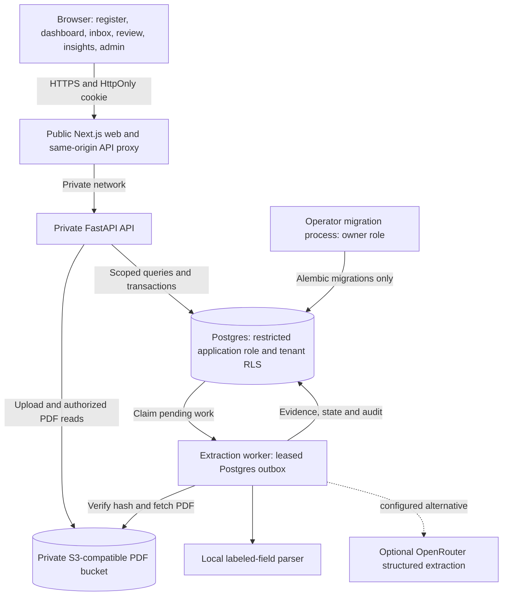
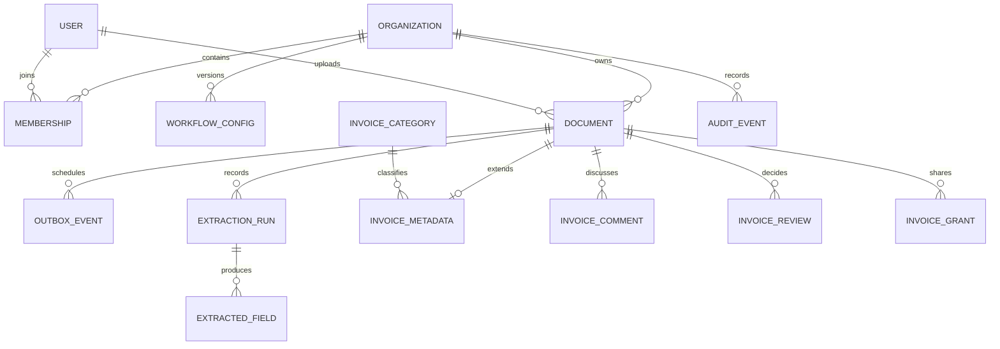
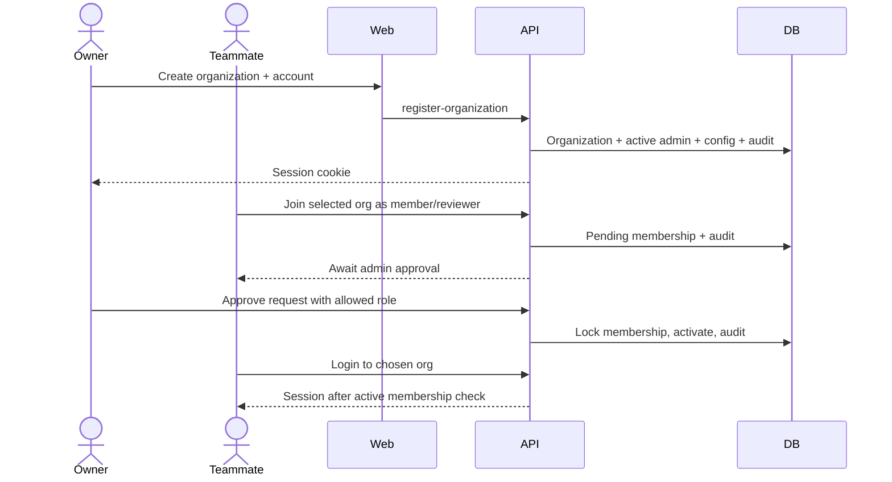
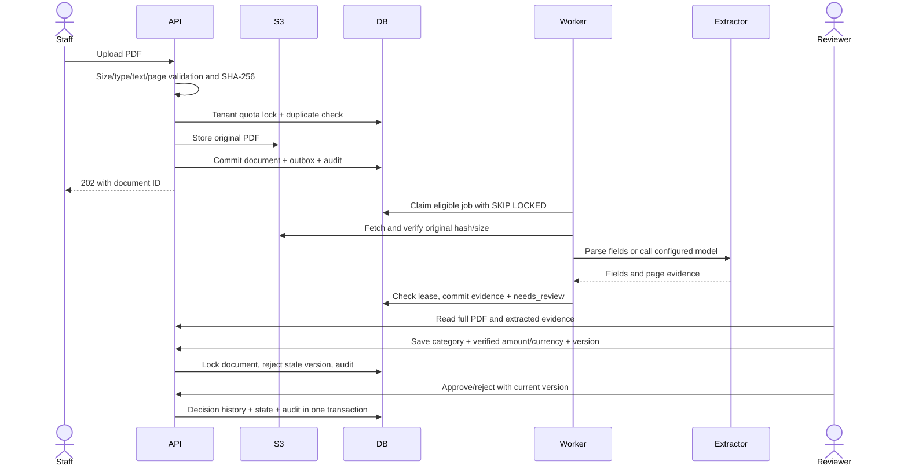
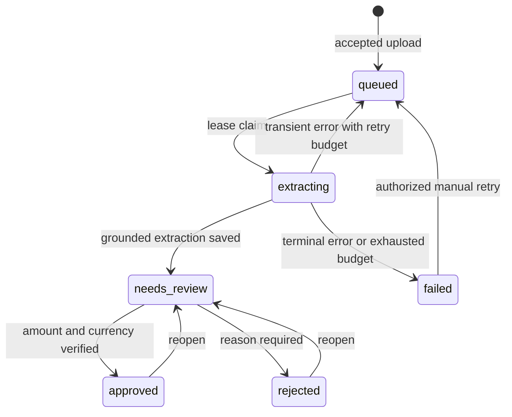

# OpsPilot system design

A multi-organization invoice review application. This document describes the implemented architecture and identifies proposed changes explicitly. Deployment instructions are in [the Render runbook](docs/deployment.md). Product scope and page walkthroughs are in [README.md](README.md).

## 1. Problem and scope

A company receives PDF invoices. Staff need to extract information, route documents to reviewers, discuss discrepancies, organize invoices by category, and track amounts awaiting approval. People must only access the companies and documents they are permitted to see.

The product supports:

- Self-service organization creation with an initial admin.
- Requests to join an organization as a member or reviewer, followed by admin approval.
- PDF intake, content deduplication, asynchronous extraction and evidence inspection.
- Original PDF viewing with page navigation, zoom and copyable text, plus download under the same authorization as invoice metadata.
- Admin-managed categories, reviewer assignment, verified money, comments and decisions.
- Workspace or restricted document visibility, with authenticated sharing links.
- Counts and currency-separated totals across all accessible invoices.
- Bounded questions answered from current database records and extracted evidence.

Approval records a workflow decision. It does not pay an invoice, establish accounting accuracy, or send anything to an external accounting system. OCR, arbitrary conversational reasoning, SSO, email verification, password recovery, payment execution and ERP connectors are not implemented.

## 2. Architecture

### Component responsibilities

| Component | Owns | Scaling boundary |
| --- | --- | --- |
| Next.js | Pages, typed API client, TanStack Query cache, same-origin proxy | Stateless web replicas |
| FastAPI | Authentication, permissions, validation, invoice workflow, PDF delivery | Stateless API replicas; Postgres connection budget applies |
| Postgres | Accounts, tenancy, workflow state, durable jobs, immutable evidence, audit | Vertical scaling first; inspect actual query plans before adding replicas |
| Worker | PDF text parsing, optional model call, evidence validation, durable completion | One active extraction per process; add workers within provider and DB limits |
| Object store | Original PDF bytes | Managed private bucket; backup/versioning configured by operator |
| Migration process | Schema and restricted-role grants | One serialized release step; owner credentials excluded from serving processes |

There is no Redis dispatch, vector retrieval, event bus, or automatic model routing in this implementation. Local Compose contains optional infrastructure experiments, but the running workflow uses Postgres directly. This keeps the durable job and invoice transaction in one database. See [ADR 003](docs/adr/003-direct-outbox-polling.md).

## 3. Trust boundaries and authorization

### Identity and organization membership

Users have one password identity and can have memberships in multiple organizations. Login chooses an organization slug; the session contains the user and organization IDs. A password is verified before an existing user can create another organization or submit a join request under that identity.

Organization creation writes the organization, active admin membership, initial workflow configuration and audit records in a transaction. Joining creates a pending membership. A pending, rejected or suspended membership cannot use an old session to enter the workspace: membership state is checked on every authenticated request.

Membership decisions lock the organization/membership records. Existing admin memberships are protected from demotion through this API. Admin transfer and recovery need a separate future workflow. Public organization search intentionally exposes only a bounded directory of organization IDs, names and slugs; it exposes no members, invoices or amounts. Organizations are discoverable, which is a product privacy choice.

### Role matrix

All document actions additionally require access to that particular document.

| Capability | Admin | Reviewer | Member | Viewer |
| --- | --- | --- | --- | --- |
| Read accessible invoices/PDFs/insights | Yes | Yes | Yes | Yes |
| Upload and retry failed extraction | Yes | Yes | Yes | No |
| Add invoice comments | Yes | Yes | Yes | No |
| Verify amount/currency and set category | Yes | Eligible reviewer | No | No |
| Approve/reject/reopen | Yes | Eligible reviewer | No | No |
| Assign reviewer | Yes | No | No | No |
| Manage visibility/grants | Yes | If uploader | If uploader | No |
| Manage categories/memberships | Yes | No | No | No |

An assigned reviewer reserves review work for that reviewer and admins. Unassigned invoices can be reviewed by an authorized reviewer. Only invoices in `needs_review` accept verified detail changes; completed decisions must be reopened before changing those details.

### Tenant and document boundaries

1. Runtime database connections use `opspilot_app`, without owner/superuser privileges.
2. Every request sets a transaction-local `app.current_org` value. Tenant tables use forced row-level security. A transaction commit clears that setting; code must set it again before subsequent tenant queries.
3. Application predicates further restrict document access. Workspace-visible invoices are available to active members; restricted invoices are available to admins, uploader, assigned reviewer and explicitly granted active teammates.
4. The same document predicate applies to list, detail, file, comments, review, questions, aggregate totals and duplicate-upload handling. Filtering occurs before pagination and aggregation.
5. Composite foreign keys prevent category, reviewer, grant or collaboration rows from pointing into another organization.

RLS enforces organization isolation. Per-document restrictions are enforced by application logic, not per-user RLS. An application credential compromise is therefore outside the protection offered by the document ACL. Audits, comments, extracted fields and review history have no application UPDATE/DELETE grants where append-only behavior is required.

### Web session and request controls

- Argon2 password hashes; signed sessions expire after eight hours.
- HttpOnly session cookie; Secure cookies and HTTPS origin required outside development.
- Same-origin Next.js proxy prevents browser exposure of the private API URL.
- Origin and Fetch Metadata checks reject cross-site mutations.
- Login and signup throttles persist in Postgres across API replicas.
- Bounded JSON requests (64 KB), upload requests and field lengths.
- Unknown credentials receive a consistent error; valid pending credentials receive an actionable pending status.
- No raw API keys, cookies, passwords, document text or email addresses in request timing logs.

Render private networking puts the web proxy in front of the API. Signup's peer throttle can group proxied traffic by the web service address. Before unrestricted public signup, configure an edge rate limit/bot challenge and a trusted client-IP design; do not blindly trust arbitrary forwarded IP headers.

## 4. Data model and invariants

| Record | Important invariants |
| --- | --- |
| Membership | Unique organization/user pair; active/pending/rejected/suspended lifecycle |
| Document | Unique `(org_id, content_hash)`; original bytes referenced by deterministic org/hash key |
| Outbox event | Created atomically with document and intake audit; claimed with a lease |
| Extraction run / field | Original provider output and exact evidence retained; review does not overwrite extraction |
| Invoice metadata | One row/document; default visibility workspace; version begins at zero |
| Verified money | Decimal `NUMERIC(20,4)`, nonnegative, amount and ISO currency both set or both absent |
| Category | Unique normalized name inside organization; archive instead of deleting referenced history |
| Review | Decision, actor, timestamp and note preserved; rejection requires a reason |
| Grant | Same-org membership; revocation affects later authenticated reads |

A currency symbol such as `$` is never silently converted into USD. Extracted money remains evidence until a reviewer verifies amount and currency. Summaries keep currencies separate, count unverified exclusions, and cover the entire accessible dataset. They do not sum the latest UI page. Currency conversion and settlement balances would need additional exchange-rate and accounting models.

## 5. Important flows

### Registration and approval

### Intake, extraction and review

### Implemented document states

### Concurrent edits

Metadata, sharing and review mutations lock the document row and compare the supplied metadata version. A successful change increments the version. A stale change returns `409`; the UI asks the user to refresh instead of silently overwriting someone else's edit. Category changes use the same optimistic version approach. Review state, decision history and audit are committed together.

A downloaded PDF cannot be recalled. Revoking a grant prevents subsequent server access; it cannot delete bytes a recipient already downloaded. Sharing is authenticated within the organization; anonymous links are not supported.

## 6. Background reliability and recovery

The outbox is the durable work queue. Workers rotate through organizations, claim eligible events with `FOR UPDATE SKIP LOCKED`, and record a five-minute lease timestamp. A replacement worker can reclaim expired leases. Completion locks and verifies the current lease so a superseded worker cannot save an obsolete result.

Transient storage/model failures receive up to three automatic attempts with backoff. Terminal parsing/grounding failures fail immediately. Manual retry permits two additional extraction jobs per document. Retries preserve intake deduplication and are audited.

This is at-least-once processing with guarded database completion. A crash after a model request but before saving its result can cause another model call and another charge. The application does not claim exactly-once model billing or zero data loss under all storage/database failures.

| Failure point | Result and recovery |
| --- | --- |
| Storage write fails before DB commit | No accepted document; API returns unavailable; client may retry |
| Storage succeeds but DB transaction fails | No `202`; a deterministic orphan object may remain; retry reuses key; orphan sweeper is future work |
| Client loses successful upload response | Content hash finds existing accessible document on retry |
| Duplicate file is restricted from uploader | Generic conflict, no existing ID/filename leak |
| Worker exits before completion | Lease expires; another worker can reclaim |
| Old worker completes after reclaim | Lease mismatch prevents stale completion |
| Provider returns invented evidence | Validation rejects result; no automatic approval |
| Concurrent review/category change | Lock and version check prevent lost update |
| Suspended user has an old cookie | Active membership check rejects new requests |
| Object contents change unexpectedly | Hash/length check blocks processing and file delivery |
| API/database outage | UI error/retry states; outbox remains durable in database |
| Bad schema deployment | `/readyz` checks required tables; restore/forward-fix migration before serving traffic |

## 7. Questions, summaries and model boundary

Workspace questions use bounded intent handling and SQL over authorized records. Supported topics include document counts, review status, verified totals, categories and per-invoice extracted fields. Responses include an `as_of` timestamp; document-field answers include filename, evidence and page citations. Unsupported questions are identified rather than answered from an unrelated global total.

This mechanism has no arbitrary SQL generation or model tool execution. It cannot reason freely about tax law, predict payments, compare unspecified date ranges or answer every natural-language phrasing. Category selection supplies an explicit query scope.

Extraction providers:

- `rules`: local deterministic parser for labeled text (`Vendor:`, `Invoice Number:`, `Invoice Date:`, `Total:`). Useful for supported formats, without model credentials.
- `openrouter`: sends PDF text to a configured model using a strict JSON schema. Checks returned values/evidence against the original text and page. Model access, cost, data handling and accuracy must be tested for the chosen deployment.
- `mock`: retained for reproducible test fixtures.

The extractor has no tools and cannot approve an invoice. Uploaded text is untrusted data. Grounding checks establish source correspondence; they do not prove that the supplier's invoice is correct.

## 8. Latency and capacity

### Instrumentation implemented

- Routed API replies contain `Server-Timing: api;dur=...` and `X-Request-ID`; the proxy forwards them. Early request-size and origin denials carry a request ID but do not include timing.
- API completion logs identify method, route template, status, duration and request ID without invoice content.
- TanStack Query polls extracting documents every two seconds, the review queue every ten seconds, and collaboration/summary views every fifteen seconds. Successful mutations invalidate affected caches immediately.
- Lists use bounded pagination; status and category filters run in SQL before pagination. Filename search is bounded and treats wildcard characters literally.
- SQL indexes cover tenant/status document queries, extracted fields, outbox availability, category metadata, grant lookup, comments and decision history.
- Browser smoke includes small sequential latency samples. These measure the local proxy/API path, not sustained throughput or production percentiles.

### Initial service objectives — targets, not measured guarantees

| Operation | Initial target | Measurement scope |
| --- | --- | --- |
| Authenticated metadata/summary read | p95 under 300 ms | API duration, warm service, documented dataset and concurrency |
| Review or comment mutation | p95 under 500 ms | Excludes user typing/network; includes database commit |
| Login/signup | p95 under 1.5 s | Includes intentionally expensive password hashing |
| Extraction visibility | p95 under 60 s for <=5 text pages | Upload acceptance to visible needs_review; depends on provider and backlog |
| Warm page interaction | User gets pending/error state immediately | Browser trace plus accessiblity/visual review |
| Availability | 99.9% monthly target | Requires deployment probes, alert routing and incident history |

The browser lazily loads a local PDF.js renderer and worker when the full document view opens. PDFs are fetched through the authenticated same-origin proxy; no third-party viewer receives invoice data. One page is rendered at a time, with bounded canvas memory and cancellation when switching documents.

The PDF upload path currently validates PDF text before returning `202`. Size bounds limit inputs but parsing is not isolated in a process with a hard CPU deadline. Untrusted public intake should add sandboxed validation and malware screening; arbitrary hostile PDFs require more than a byte/page limit.

### Local measurement — 2026-09-26

The fresh-company browser suite ran 20 sequential same-origin reads per endpoint on the local Docker stack, after one two-page invoice was reviewed. Times include browser fetch and reading the response body. Three test accounts and one category were created. This is a small warm smoke sample, not a concurrency/load test or a production SLO result.

| Endpoint | Samples | p50 | p95 | Maximum |
| --- | --- | --- | --- | --- |
| `/v1/documents` | 20 | 12.0 ms | 67.5 ms | 97.5 ms |
| `/v1/workspace/summary` | 20 | 5.4 ms | 7.3 ms | 7.3 ms |

Reproduce with `make smoke-workspace`. Capture machine, dataset, concurrency and provider details before comparing another run or claiming a capacity improvement.

### Capacity model

Example planning input: 100 organizations × 100 invoices/day = 10,000/day, or 0.116 uploads/second average. At 10× peak, arrival rate is approximately 1.16/second. With mean extraction duration of 8 seconds, Little's Law gives about 9.3 concurrent extractions at peak. At a 70% utilization target, roughly 14 single-extraction workers would be needed **if provider quotas and database capacity permit**. This is a sizing example, not a demonstrated scale result.

A 400 KB average PDF at 10,000/day adds about 4 GB/day before replication and backups. One worker calling a slow model cannot sustain that hypothetical peak. Measure arrival rate, job age, extraction duration, token use and provider quotas before sizing a real deployment.

### Scale changes triggered by evidence

| Observed constraint | Next change | Tradeoff |
| --- | --- | --- |
| Growing oldest job age | Add bounded workers; provider budget/rate limit first | More parallel model calls and DB connections |
| Worker tenant scan overhead | Indexed scheduler or dispatch queue | Additional moving parts; retain DB outbox as source of truth |
| Summary p95 grows | Inspect EXPLAIN ANALYZE; targeted indexes/rollups | Rollups need freshness and per-document access semantics |
| Large offset scans | Keyset pagination `(created_at,id)` | More complex cursors; stable ordering during concurrent uploads |
| Polling dominates API load | SSE notifications with authorized reconnect | Long-lived connections, backpressure and auth revocation handling |
| UI dataset grows | Server search and paginated tables; virtualize long lists | Keep accessibility and keyboard navigation intact |
| Single DB failure unacceptable | Managed HA/PITR and tested restore | Additional cost; replicas do not replace backups |

API and worker connection pools must fit within the Postgres connection limit. Increasing replicas without budgeting pool sizes can reduce availability. An additional cache must include organization and authorization scope; a global totals cache would leak restricted invoice information.

## 9. Deployment and operations

Render topology: public web service, private API service, background worker and managed Postgres in one region, with external private S3/R2 storage. The blueprint is [render.yaml](render.yaml). Database creation and owner-run migrations precede the Blueprint's application rollout. No seeded users are needed; the first real organization is created through `/register`.

Operational responsibilities:

1. Keep owner credentials in the migration environment; runtime has only the restricted connection.
2. Create a private bucket, scoped credentials, versioning/retention and backups appropriate to invoice data.
3. Configure HTTPS origin and strong session secret; rotate any previously disclosed credentials.
4. Verify `/readyz` from the private API shell (private services do not use a public HTTP health path).
5. Run fresh organization/member/reviewer and PDF smoke flows on the actual deployed origin.
6. Configure error-rate, latency, worker job-age, DB utilization and storage alerts with a recipient.
7. Exercise backup restore into an isolated database and verify application consistency before promising an RPO/RTO.
8. Disable automatic release until schema compatibility, checks and rollback procedure are reviewed.

There is no tested production restore, observed availability history, centralized metrics dashboard or live-model accuracy benchmark yet. Logs and timing headers are instrumentation, not an alerting service.

## 10. Verification and review checklist

- Registration transaction, pending denial, admin approval, rejection, role protection and suspension.
- Existing-email password verification before joining/creating another organization.
- Cross-organization read/write denial using the restricted database role.
- Restricted-document denial across file, metadata, list, questions, totals, comments, retry and deduplication.
- Immediate grant revocation on subsequent requests; stale version conflicts.
- Immutable extraction evidence and append-only decisions/comments/audit grants.
- Decimal totals across currencies, verified/unverified exclusions, aggregate scope beyond 50 invoices.
- Fresh browser registration through approval, upload, full PDF review, discussion, decision and insights.
- Responsive page checks, loading/error states, login with no hard-coded account defaults.
- API/web lint, static types, tests, production builds and deployment image checks in CI.

Use the API-generated OpenAPI document and typed web client to review endpoint contracts. Tests are evidence for their covered scenarios, not proof that all security or performance risks have been eliminated.

## 11. Interview walkthrough

Start with a real workflow: “A member joins an organization, an admin approves access, the member uploads an invoice, and a reviewer verifies and approves it.” Trace the architecture diagram, then choose one deep dive:

- Why the outbox and invoice are committed together; what can still leave an orphan file.
- How tenant RLS differs from document-level authorization; how totals avoid leaking restricted data.
- Why reviewer-confirmed money is separate from immutable model extraction.
- How a lease prevents an old worker committing after a replacement worker.
- How concurrent reviewer edits get a conflict instead of a silent overwrite.
- Why bounded database questions and exact evidence are safer to demonstrate than unsupported model claims.
- Which measurements would justify more workers, a dispatch queue, caching or keyset pagination.

A defensible design explains its failure modes, tradeoffs, measurements and unfinished boundaries. No single architecture is best for every workload.
